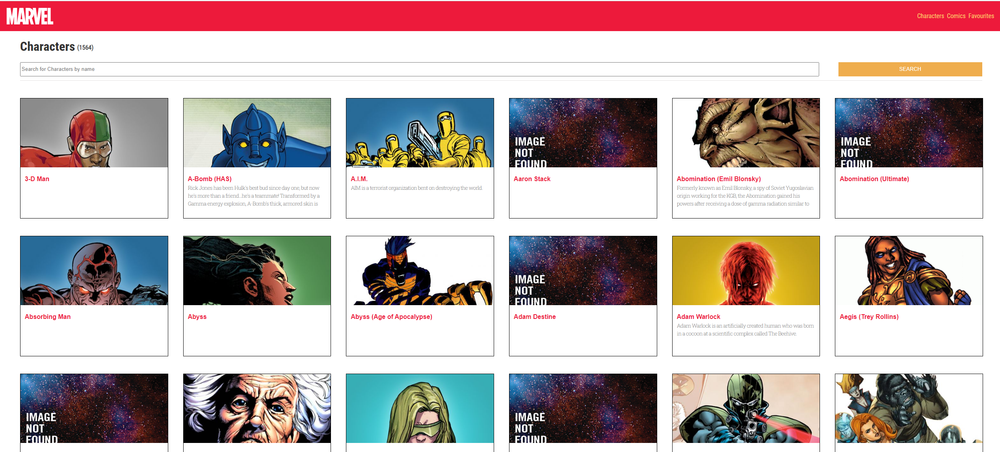

# krauzinEffectiveLab
 Для работы зайдите на сайт developer.marvel и получите свои api ключи.
 после этого вставьте в файл .env

VITE_PUBLIC_API_KEY = {ваш публичный ключ}
VITE_PRIVATE_API_KEY = {ваш приватный ключ} 
VITE_BASE_URL=https://gateway.marvel.com

